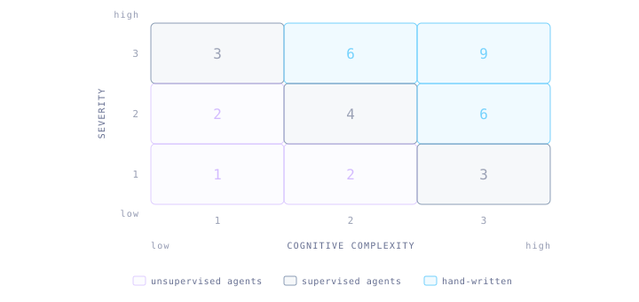
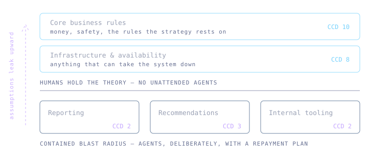
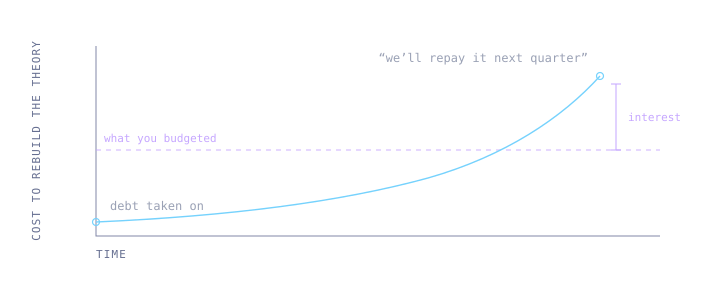

It is easy to end up in one of two absolutes: either agentic workflows are the future and mark the end of traditional coding, or, agentic workflows have no place in modern software development whatsoever. However, there may be a third way, one that recognizes the problems, and addresses the risk in a methodical way.

I'd like to introduce you to _Cognitive Debt_ - the condition where no human understands a part of your system - and to the _Cost of Cognitive Debt_, or _CCD_, an estimation of what that condition costs in reality.

## Accumulating unknown unknowns

It makes sense that not understanding the inner workings of a system which a company's strategy relies on has real-world costs. You would, for instance, be unable to create a plan for overtaking your competitors without understanding your own technical limitations and advantages.

Parts of a system not understood by humans could be thought of as subject to Cognitive Debt, distinct from technical debt. Where technical debt describes understood technical problems within a system - Cognitive Debt describes the fact that you don't even understand if you have a problem.

This is not a new observation. Peter Naur argued in [Programming as Theory Building](https://pages.cs.wisc.edu/~remzi/Naur.pdf), back in 1985, that a program is not limited to its source code but a theory held in the minds of the people who built it. Lose the people and you have lost the reasons for why the program exists at all, even though it still compiles. What agentic workflows change is that we can now produce code that never had a theory behind it to begin with.

It is reasonable to assume that Cognitive Debt eventually can lead to Cognitive Meltdown - a state where no human is able to understand how a system works given any reasonable amount of time. This would render the system useless from a business point of view, while the cost of recovering insight would outweigh any potential gains.

## A scale of understanding

Understanding can range from a simple acknowledgement of the problem a piece of solves to a deep intuition. Wile a review may give you a mental note on what a piece of code does, it is often necessary to hand-write the code to acquire the deepest form of understanding. Supervising agentic workflows can give you one level of insight, while prolonged manual struggle with the code gives you _mechanical intuition_.

## Putting a number on it

To make sense of this we may be helped by a method. I suggest scoring each part of the system from 1 to 3 on two factors: cognitive complexity and severity (affecting business, money, or safety).

The CCD of a part of the system is roughly the product of the two. A complex domain with high severity amplifies the Cost of Cognitive Debt.

What the score decides is level of supervision. A high CCD means agents run supervised or not at all. A low one means we can let them run unsupervised, as long as we plan for the repayment.

The point of the score is not precision. It is to force the conversation to happen per domain, and to happen before the debt is taken on rather than after a meltdown.

## What must be understood

Now, assuming that we have encapsulated our system into separate domains, or a layered architecture, we can address this problem with some granularity.

It seems natural that the core business rules of a system need to be well understood by not just developers, but by leadership and stakeholders as well, and this should result in a conservative view of what parts of the system we can expose to agentic workflows, and to the risk of Cognitive Debt.

For instance, we would be wise not to introduce unsupervised agentic workflows in layers of a system that are concerned with critical business rules. This part of the system would score a 9.

Similarly, it seems obvious that any infrastructure layer that could bring the system down for any period of time would have to be supervised and understood by humans. These parts of the system would score a high CCD value as well.

So far I agree with the agentic skeptic perspective.

## Loss we can accept

But below these levels of system architecture, the impact of Cognitive Debt may become a little more contained, given a modular architecture. Inside of a non-critical domain, within a contained blast radius, we could allow ourselves to accumulate some Cognitive Debt, as long as the cost thereof would be outweighed by potential gains.

There is still a risk, but it is contained. We could still have a Cognitive Meltdown within this scoped context, but not all domains are equally essential for the system fulfilling its purpose, so we could make a risk assessment and accept this Cost of Cognitive Debt.

## Paying it back

Now, in finance, debt is something that you are expected to pay back eventually. If we are to introduce the idea of calculated acceptance of Cognitive Debt, it makes sense to plan for how to get out of the debt. No one in their right mind would borrow more than they are theoretically able to pay back.

Repayment here means a human rebuilding the theory, reshaping it into something a person can hold in their head, and building mechanical intuition for how it behaves.

We can extend the metaphor by introducing interest. The cost of repayment is not constant, it grows. Every month the code drifts further from anybody's mental model, the people who held the surrounding context move on, and incorrect assumptions are hardened into surrounding code. Debt you meant to repay next quarter is more expensive next quarter than it is today.

Agentic workflows are here to stay and we need a framework for reasoning in a methodical way about non-deterministic workflows in products that entire businesses rely heavily on. In the past leadership and stakeholders were often oblivious to the risks and impact of architectural decisions, relying heavily on responsible technical experts, who often saved the product by understanding the business needs. Now that many technical experts have resigned themselves to the same state of delightful ignorance, we need to address this risk in a structured way.

Is this a reasonable way of addressing and reasoning about the risk introduced by agentic workflows? I would like to hear where it breaks - [start a discussion on GitHub](https://github.com/ljtn/epiq/discussions) and let me know your thoughts.
