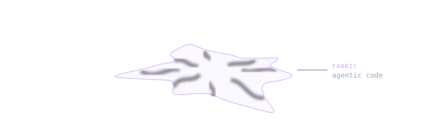
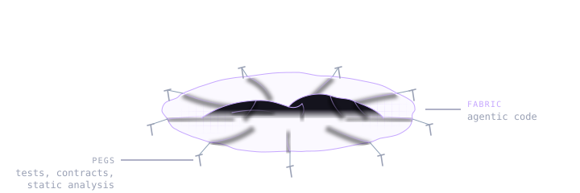
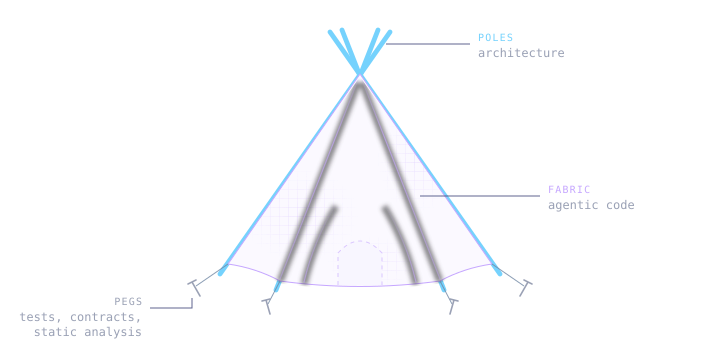

Agentic code can be thought of as a fabric. It is easily shaped and can assume any form with little effort, but it is hard to build something rigid out of it. While agents can produce brilliant snippets of code on par with the cutting edge of human knowledge, cohesion and consistency remain a challenge.

## The peg fallacy
There is a real problem with the softness of fabric alone. A natural inclination is to address the lack of structure in agentic workflows by adding tests, contracts and static analysis. However, pinning down the edges with pegs does little to enforce internal structural rigidity. Without an internal structure to apply the constraining forces upon we are still in a soft, flat mess.

## Building a tipi
We'd be helped by sturdy poles to stretch the fabric into its desired shape. In software terms - a distinct architecture by which all additional work is guided and upon which the tests and static analysis apply constraining forces. In a tent, there is a symbiotic relationship between the internal structure, the fabric and the pegs. Software is much the same. Without an architecture to stretch the web of features across, the constraining pegs are of little use. Without the pegs, on the other hand, we might wake up in the morning with all of the wooden structure in place, but the fabric in a tree top far away.

That's the theory. Here is how it played out on my project.

## A thousand doubts
In the early summer of 2025 I started building Epiq, an issue tracker that keeps its state in the repository and syncs over Git.

Back then agentic workflows were but distant rumors. Hence, manual struggle with the code, endless rubber ducking sessions, and 11h meditation sessions (road trips) charred the project's architecture in the fire of a thousand doubts.

Trees in the forest of ideas were selected, pruned of false branches. Then logged, pruned again, sharpened, and finally knit together. In the end, a few non-negotiable architectural poles emerged:

- User-scoped, append only event logs for persistence
- Events with [CRDT](https://en.wikipedia.org/wiki/Conflict-free_replicated_data_type)-like properties, only referencing shared history
- Causal order resolution, with wall-clock tie breaks

Upon these rests every later feature.

## Constraints over slop
None of these is exotic on its own, but together they are not a mainstream solution. One could call this architecture an _unlikely_ outcome had the workflow been 100% agentic, as anything unorthodox is punished by probabilistic models.

The solution becomes more likely when revealing the constraints:

- The board lives in the repo with the code (no server, vendor-agnostic)
- Git is the only transport
- Users are never asked to resolve merge conflicts
- Several people, and agents, might edit at the same time, on- or offline

These constraints were derived from [a vision](./vision-drift.html). Agents tend not to discover non-standard solutions when not guided by constraints, and without a vision, no constraints are given.

Agents lacking a vision for the codebase is why, if you ask for a red button, and then for a blue button, you might get two different button components rather than a single configurable button. The fundamental principles and constraints of a system benefit from being derived from a human vision.

## A blessing in disguise

The initial absence of agentic workflows made for a mostly manually crafted, well-understood internal structure. Once the poles were in place, in late summer 2026, the project experienced the fortunate event of a fabric factory opening its gates a meter away. Enter Claude Code. Had agentic workflows been introduced any earlier, it might have been to the detriment of the architecture. As it was, the agent arrived at the precise moment when a fabric of features had a frame to stretch across.

Suddenly not only features were cheap, but tests too. You could add a thousand tent pegs for a single pole, firmly pinning it to the ground. The core is now pegged down with paranoid tests. A whole suite tries to break the concurrency model, others try to break the Git interactions, and one simulates a team of 20 using the tracker intensely every day for 10 years, verifying the board is still usable and responsive at scale.

## The great inversion
The observant reader might have noticed that there is a common denominator between all of the foundational poles in this project. They are all concerned with the data model.

A common notion is that data is soft and software is rigid. Agentic workflows have challenged, one might even say, inverted, this perceived relationship. What has not changed, however, is the cementing effect data has on a system. Data comes with migrations, uncharted sources, varying quality, risky transformations, all of which are petrifying to system evolution.

Picking the right data model is not an afterthought, but a core feature of the architecture. A pole to stretch the soft tissue of code across, nailed to the ground with tests.

On this project, the data model has proven not only essential for distributed live collaboration, but has also resulted in an evolvable system. So far every new feature has been added by deriving information from the logs in a new way or by adding another event type, never by migrating existing data. When image attachments were added, for instance, all it took was another event type, which newer clients recognized, and older ones ignored. When advanced statistics were added, it was a matter of identifying derivable insights from the event log.

Not all systems live under the same constraints, and other visions call for other structural poles. In any case, the art of not writing all the code is [knowing which parts you must engage with and build intuition for](./cost-of-cognitive-debt.html).

## Back to the tipi
There is still a need for manual crafting and human understanding of the central principles of a system. Agentic workflows can help us wrap up our framing in beautiful ornaments in no time and help us pin it firmly to the ground with a thousand pegs. However, without well-understood, sturdy poles of architecture, we have nothing but a soft, formless mess. Ornate, but flat, wet and tangled.

Does this resonate with you, or do you disagree? Please share your thoughts below.
